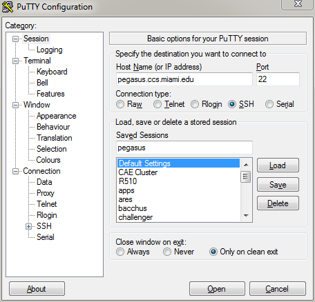
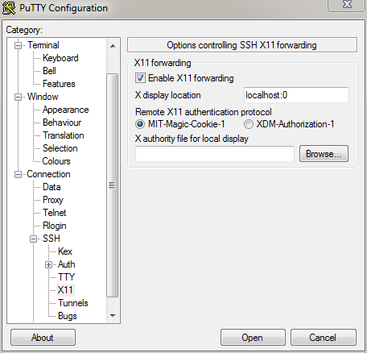

# Pegasus Connections

Use a secure-shell (SSH) client to connect to Pegasus for secure,
encrypted communication. From within UM’s secure network (SecureCanes or
wired connection on campus) or VPN, connect to Pegasus with:

### Windows

Connect using a terminal emulator like PuTTY
([www.putty.org](http://www.putty.org))

Log in with your CCS Account credentials:

    username@pegasus.ccs.miami.edu (optional username @ host)
    22 (port)
    SSH (connection type)

### Mac and Linux

Connect with the Terminal program, included with the Operating Systems.

Log in with your CCS Account credentials directly:

    bash-4.1$ ssh username@pegasus.ccs.miami.edu
    username@pegasus.ccs.miami.edu’s password:

or be prompted for CCS Account credentials:

    bash-4.1$ ssh pegasus.ccs.miami.edu
    login as: username
    username@pegasus.ccs.miami.edu’s password:

  

To use SSH key pairs to authenticate, see the CentOS wiki:
<http://wiki.centos.org/HowTos/Network/SecuringSSH>

  

## Pegasus Welcome Message

The Pegasus welcome message includes links to Pegasus documentation and
information about your disk quotas.

    ------------------------------------------------------------------------------
                         Welcome to the Pegasus Supercomputer
               Center for Computational Science, University of Miami 
    ------------------------------------------------------------------------------
    ...
    ...
    ...
    --------------------------Disk Quota------------------------------
    filesystem | project    | used(GB)   | quota (GB) | Util(%)   
    ============================================================
    nethome    | user       | 0.76       | 250.00     |    0%
    scratch    | projectID  | 93.32      | 20000.00   |    0%
    ------------------------------------------------------------------
         Files on /scratch are subject to purging after 21 days       
    ------------------------------------------------------------------
    [username@pegasus ~]$

  

## Forwarding the display with x11

To use graphical programs on Pegasus, the graphical display must be
forwarded securely. This typically requires running an X Window System
server and adding the `-X` option when connecting via SSH.

  

### Download an X Window System server

  - For Windows, Xming with the default installation options:
    <http://sourceforge.net/projects/xming/files/latest/download>
  - For Mac, XQuartz (OSX 10.8+): <http://www.xquartz.org/> *OS X
    versions 10.5 through 10.7 include X11 and do not require XQuartz.*

  

### Connect to Pegasus with X11 forwarding

Launch the appropriate X Window server **before** connecting to Pegasus
via SSH.

#### Windows: Configure PuTTY for X11 display forwarding

In PuTTY Configuration,

  - scroll to the **Connection** category and expand it
  - scroll to the **SSH** sub-category and expand it
  - click on the **X11** sub-category

On the X11 Options Panel,

  - check "Enable X11 forwarding"
  - enter "`localhost:0`" in the "X display location" text field

#### Mac: Connect with X11 flag

Using either the Mac Terminal or the xterm window, connect using the
`-X` flag:

    bash-4.1$ ssh -X username@pegasus.ccs.miami.edu

  

### Launch a graphical application

Use `&` after the command to run the application in the background,
allowing continued use of the terminal.

    [username@pegasus ~]$ firefox &

  

## Connecting to Pegasus from offsite

Pegasus and other CCS resources are only available from within the
University's secure campus networks (wired or SecureCanes wireless). To
access Pegasus while offsite, open a VPN connection first. CCS does not
administer VPN accounts.

University of Miami VPN:
<https://www.it.miami.edu/a-z-listing/virtual-private-network/index.html>
