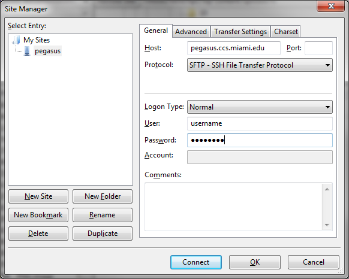

# Transferring Files to Pegasus

Pegasus supports multiple file transfer programs such as FileZilla and
PSFTP, and common command line utilities such as `scp` and `rsync`. Use
Pegasus head nodes (login nodes) for these types of file transfers. For
transferring large amounts of data from systems outside the University
of Miami, CCS AC also offers a gateway server that supports SFTP and
Globus.

## Using command line utilities

Use `cp` to copy files within the same computation system. Use `scp`,
`sftp`, or `rsync` to transfer files between computational systems (e.g.
 Pegasus scratch to Visx project space). When executing multiple
instantiations of command line utilities like rsync and scp, please
***limit your transfers to no more than 2-3 processes at a time.***

### scp

An example transfer might look like this:

    [localmachine: ~]$ scp /local/filename \
                username@pegasus.ccs.miami.edu:/scratch/projectID/directory

To transfer a directory, use the `-r` flag (recursive):

    [localmachine: ~]$ scp -r /local/directory \
                username@pegasus.ccs.miami.edu:/scratch/projectID/directory

Consult the Linux man pages for more information on scp.

### rsync

The rsync command is another way to keep data current. In contrast to
scp, rsync transfers only the changed parts of a file (instead of
transferring the entire file). Hence, this selective method of data
transfer can be much more efficient than scp. The following example
demonstrates usage of the rsync command for transferring a file named
"firstExample.c" from the current location to a location on Pegasus.

    [localmachine: ~]$ rsync firstExample.c \
                username@pegasus.ccs.miami.edu:/scratch/projectID/directory

An entire directory can be transferred from source to destination by
using rsync. For directory transfers, the options `-atvr` will transfer
the files recursively (`-r` option) along with the modification times
(`-t` option) and in the archive mode (`-a` option). Consult the Linux
man pages for more information on rsync.

## Using FileZilla

FileZilla is a free, user friendly, open source, cross-platform FTP,
SFTP and FTPS application.

Download the FileZilla client here:
<https://filezilla-project.org/download.php?show_all=1> and follow the
installation instructions for the appropriate platform
(<http://wiki.filezilla-project.org/Client_Installation>).

Launch FileZilla and open **File : Site Manager**.

Click the "New Site" button and name the entry.

    Host:       pegasus.ccs.miami.edu
    Protocol:   SFTP
    Logon Type: Normal
    enter your username and password

Selecting Logon Type: **Ask for password** will prompt for a password
each connection.

Click the "Connect" button. Once connected, drag and drop files or
directories between your local machine and the server.

## Using the gateway server

To transfer large amounts of data from systems outside the University of
Miami, use the gateway server. This server supports Globus and SFTP file
transfers. Users ***must be a member of a project*** to request access
to the gateway server. E-mail <hpc@ccs.miami.edu> to request access.

### SFTP

Open an SFTP session to the gateway server using your CCS account
credentials: `gw.ccs.miami.edu`

    [localmachine: ~]$ sftp username@gw.ccs.miami.edu
    ..
    sftp> 

### Globus

For the CCS Globus Server,

    The Host:    gw.ccs.miami.edu
    The DN:      /C=US/O=Globus Consortium/OU=Globus Connect Service/CN=7ef3df44-c348-11e3-b46f-22000a971261
    The Scheme:  GridFTP

Users can log into Globus with UM CaneID account credentials (previous
Globus IDs can also be linked with UM Globus accounts). Once logged in,
create an endpoint with our Globus Server information to begin
transferring files. Our Globus Server requires authentication. The
identity provider is MyProxy, the Host and DN are the same as our Globus
Server.

For more information about data sharing with Globus:
<https://www.globus.org/data-sharing>
