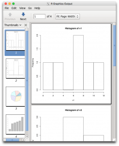

# R on Pegasus

To run the R programming language on Pegasus, first load an R module
with `module load R/version`. Use the command `module avail` to see a
list of available software, including R versions. For more information
about Pegasus software, see [Software on the Pegasus
Cluster](README.md).

## Batch R

To run a batch R file on Pegasus compute nodes, submit the file to LSF
with `R CMD BATCH filename.R`. Remember to include the `-P` flag and
your project, if you have one.

    [username@pegasus ~]$ module load R/2.15.2
    [username@pegasus ~]$ bsub -q general -P projectID R CMD BATCH example1.R
    Job is submitted to <projectID> project.
    Job <6101046> is submitted to queue <general>.

See `example1.R` below. For more information about `bsub` and scheduling
jobs, see [Scheduling Jobs on the Pegasus Cluster](../jobs/).

  

Batch jobs can also be submitted to LSF with script files.

    example.job
    #!/bin/bash
    #BSUB -J R_job            # name of your job
    #BSUB -R "span[hosts=1]"  # request run script on one node
    #BSUB -q general          # request run on general queue
    #BSUB -n 1                # request 1 core
    #BSUB -W 2                # request 2 minutes of runtime
    #BSUB -P projectID        # your projectID
    R CMD BATCH example1.R    # R command and your batch R file

  

    [username@pegasus ~]$ bsub < example.job

  

## Interactive R

Load an R module, then submit an interactive R session with `bsub -Is`.
Specify your project with the `-P` flag.

    [username@pegasus ~]$ module load R/2.15.2
    [username@pegasus ~]$ bsub -Is -q interactive R
    or
    [username@pegasus ~]$ bsub -Is -P hpc R

  

## R packages

From the R prompt, install any R package to your personal R library with
the standard `install.package()` R command. Choose `y` when asked about
using a personal library, and `y` again if asked to create one.

    >  install.packages("doParallel", repos="http://R-Forge.R-project.org")
    Warning in install.packages("doParallel", repos = "http://R-Forge.R-project.org") :
      'lib = "/share/opt/R/3.1.2/lib64/R/library"' is not writable
    Would you like to use a personal library instead?  (y/n) y
    Would you like to create a personal library
    ~/R/x86_64-unknown-linux-gnu-library/3.1
    to install packages into?  (y/n) y
    ...

  

### R file examples

`example1.R`

-----

``` r
 # create graphical output file
pdf("example1.pdf")

# Define two vectors v1 and v2
v1 <- c(1, 4, 7, 8, 10, 12)
v2 <- c(2, 8, 9, 10, 11, 15)

# Creat some graphs
hist(v1)
hist(v2)
pie(v1)
barplot(v2)

# close the file
dev.off() 
```

  

If you have forwarded your display, open the pdf from the Pegasus prompt
with evince.

    [username@pegasus ~]$ evince example1.pdf

  


